<div align="center">
  
  
  [](https://git.io/typing-svg)
  
  <p>
    <a href="https://www.linkedin.com/in/david-cardoso"></a>
    <a href="mailto:davidcardoso.dev@gmail.com"></a>
    <a href="https://github.com/daaviinchiii"></a>
    
  </p>
</div>

---

## 👨‍💻 Sobre Mim

```typescript
const davidCardoso = {
  info: {
    nome: "David Cardoso",
    idade: 18,
    localização: "Açores, Portugal 🇵🇹",
    escola: "EPROSEC",
    role: "Full Stack Developer"
  },
  
  code: {
    frontend: ["React", "React Native", "HTML5", "CSS3", "JavaScript"],
    mobile: ["Flutter", "Dart", "Android"],
    desktop: ["Electron"],
    backend: ["Node.js", "Express", "REST APIs"],
    databases: ["MongoDB", "SQLite"],
    tools: ["Git", "VS Code", "Figma", "Android Studio"]
  },
  
  currentFocus: {
    learning: ["React Native", "Advanced Flutter", "Node.js"],
    building: ["Dashboard Applications", "Real-time Monitoring Systems"],
    improving: ["System Architecture", "UI/UX Design", "Code Quality"]
  },
  
  goals2025: [
    "🌟 Contribute to Open Source projects",
    "📱 Launch mobile apps on stores",
    "🎓 Master full-stack development",
    "👥 Build a strong developer network",
    "💼 Land first developer role"
  ],
  
};
```

---

## 🚀 Projetos em Destaque

<div align="center">

<table>
<tr>
<td width="100%" valign="top">

### 🖥️ Electron Desktop App
**Aplicação desktop multiplataforma**

```yaml
Tech Stack:
  Framework: Electron
  Language: JavaScript
  Features:
    - Inventory management
    - Farm monitoring system
    - Token authentication
    - Persistent storage
```

**Status:** 🟢 Funcional

</td>
</tr>
</table>

</div>

---

## 🛠️ Tech Stack & Tools

<div align="center">

### 💻 Frontend & Mobile Development


### ⚙️ Backend & Database


### 🔧 Tools & Platforms


### 🖥️ Operating Systems


</div>

---

## 📊 GitHub Statistics

<div align="center">
   
  
</div>

<div align="center">
  
</div>

---

## 📈 Contribution Activity

[](https://github.com/ashutosh00710/github-readme-activity-graph)

<div align="center">
  


</div>

<details>
<summary>📊 More Stats</summary>
<br>

<div align="center">
  


</div>

</details>

---

## 🏆 GitHub Achievements

<div align="center">
  
</div>

---

## 💼 Experience & Education

<table>
<tr>
<td width="50%" valign="top">

### 🎓 Education
**EPROSEC**  
*Açores, Portugal*

**Universidade dos Açores**  
*Licenciatura em Tecnologias*

Studying technology with focus on:
- Software Development
- Web & Mobile Applications
- System Architecture
- UI/UX Design

</td>
<td width="50%" valign="top">

### 💻 Skills Development

**Frontend**: ⬛⬛⬛⬛⬛⬛⬛⬛⬜⬜ 80%  
**Mobile**: ⬛⬛⬛⬛⬛⬛⬛⬜⬜⬜ 70%  
**Backend**: ⬛⬛⬛⬛⬛⬛⬜⬜⬜⬜ 60%  
**UI/UX**: ⬛⬛⬛⬛⬛⬛⬛⬛⬜⬜ 75%  
**Git/GitHub**: ⬛⬛⬛⬛⬛⬛⬛⬛⬛⬜ 85%  

</td>
</tr>
</table>

---

## 🎯 Current Status

<div align="center">

```javascript
const currentStatus = {
  🔭 working_on: "Dashboard Application with real-time monitoring",
  🌱 learning: "Advanced React Native & Node.js patterns",
  👯 looking_to: "Collaborate on open source projects",
  💬 ask_me_about: "React, Flutter, Node.js, or any tech stuff!"
};
```

</div>

---

## 📫 Connect With Me

<div align="center">

[](https://www.linkedin.com/in/david-cardoso)
[](https://github.com/daaviinchiii)

<br/>

### 💡 Open to:
🤝 Collaborating on open source projects | 💼 Development opportunities | 🎓 Learning & mentorship | 🚀 Challenging and innovative projects

</div>

---

## 💡 Developer Wisdom

<div align="center">


</div>

---

## 📚 Development Philosophy

```mermaid
graph LR
    A[💡 Ideate] --> B[🔨 Build]
    B --> C[🧪 Test]
    C --> D[🚀 Deploy]
    D --> E[📊 Analyze]
    E --> F[🔄 Improve]
    F --> A
    
    style A fill:#58679b,stroke:#333,stroke-width:2px,color:#fff
    style B fill:#58679b,stroke:#333,stroke-width:2px,color:#fff
    style C fill:#58679b,stroke:#333,stroke-width:2px,color:#fff
    style D fill:#58679b,stroke:#333,stroke-width:2px,color:#fff
    style E fill:#58679b,stroke:#333,stroke-width:2px,color:#fff
    style F fill:#58679b,stroke:#333,stroke-width:2px,color:#fff
```

<div align="center">



**"First, solve the problem. Then, write the code."** – John Johnson
<div align="center">

### 🤝 Thanks for Visiting!

</div>


